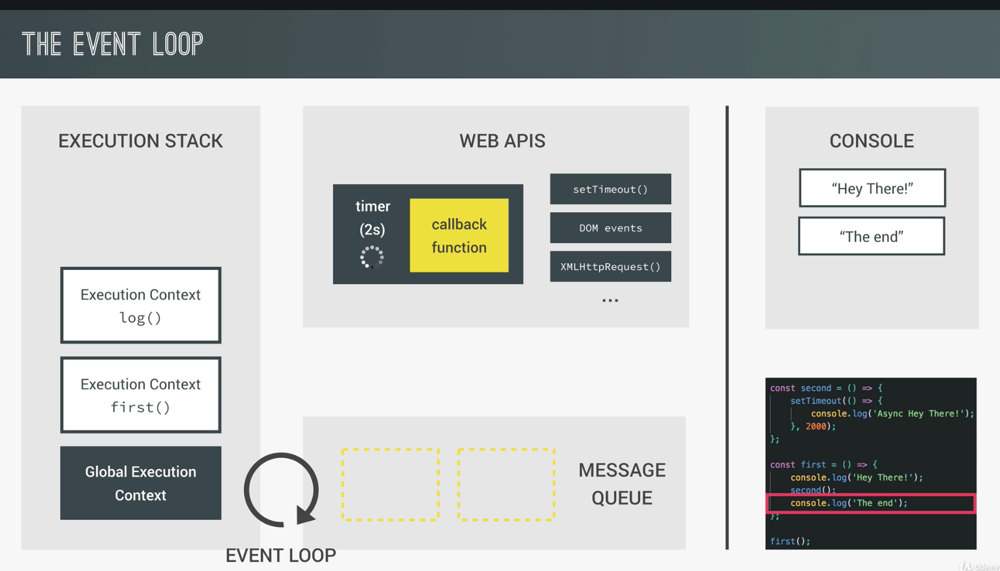
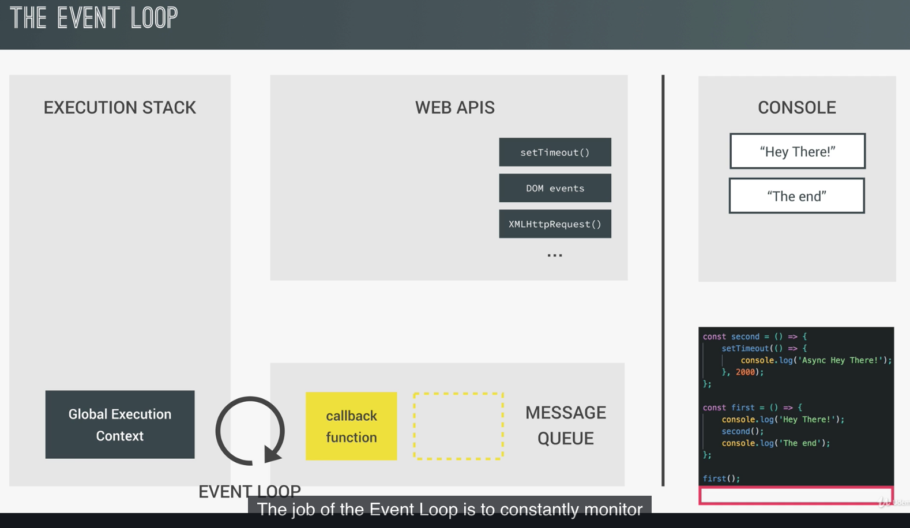
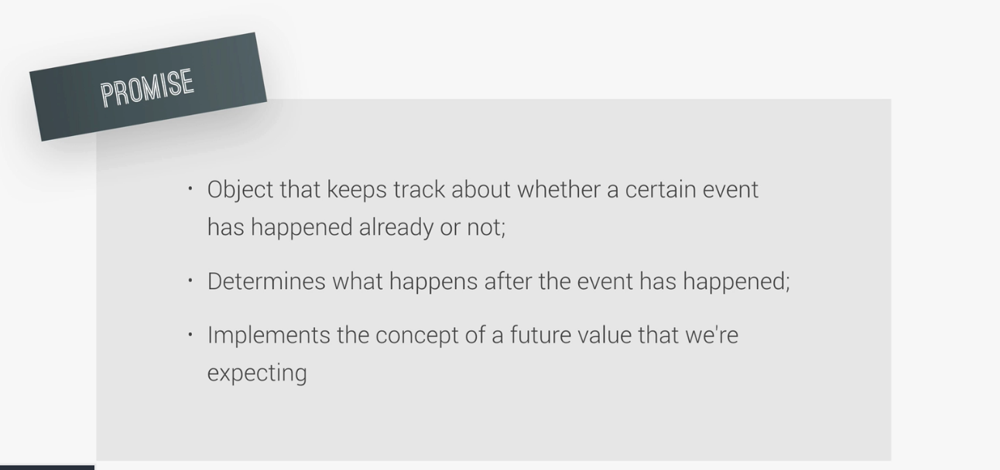
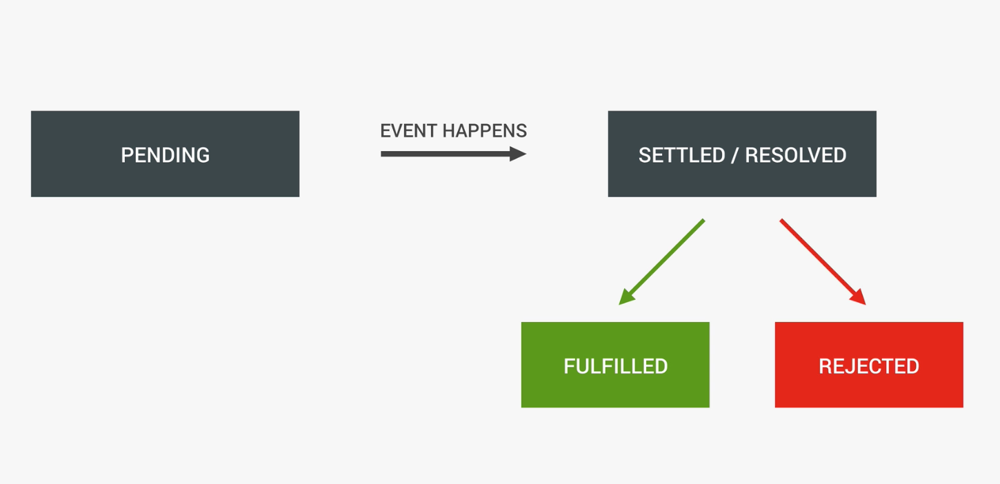
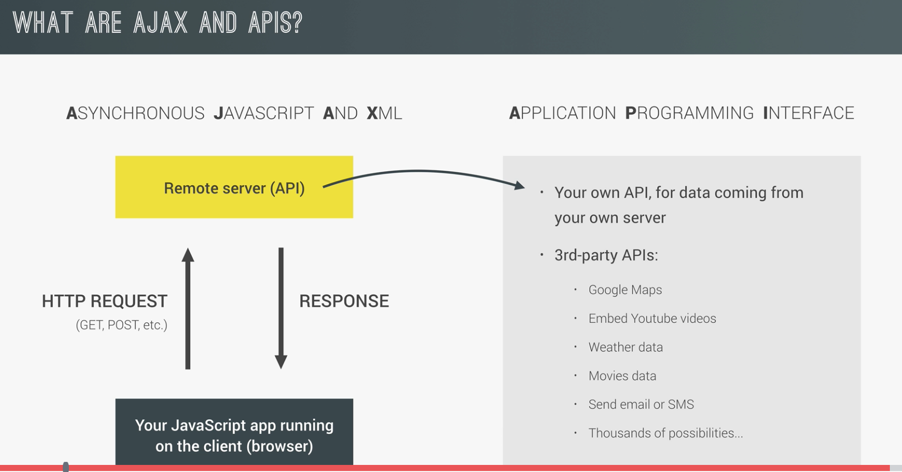
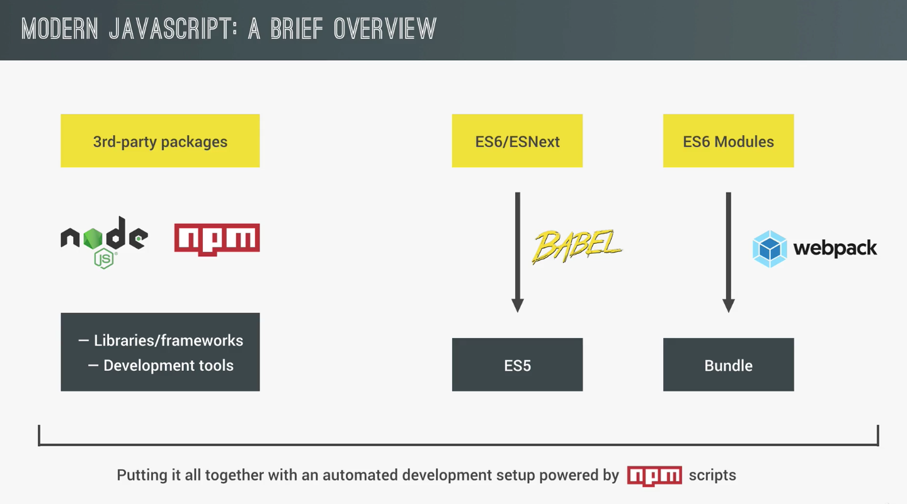
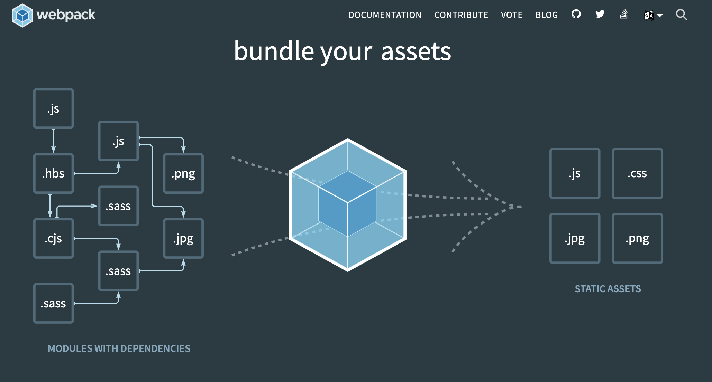
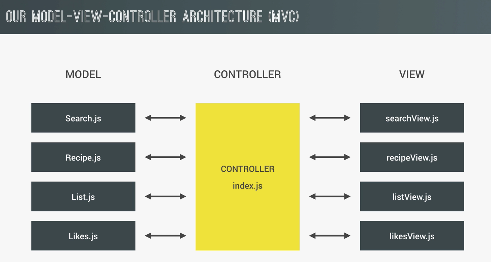

# js_course
JS, and ...
Master JavaScript with the most complete course! Projects, JavaScript ES6+, OOP, AJAX, Webpack

https://github.com/jonasschmedtmann/complete-javascript-course

http://codingheroes.io/resources/


### Section 1 - Intro

### Section 2 - Js language basics
1. Variables and Data Types
2. Basic Operators
3. Operator Precedence
4. If / else statements
5. Boolean logic
6. The Ternary Operator and Switch Statements
7. Truthy and Falsy values and equality operators
8. Functions
9. Function Statements and Expressions
10. Arrays
11. Objects and properties
12. Objects and methods
13. Loops and iteration

### Section 3 - How Js works behind the scenes

1. Hoisting  ... 'sollevamento'


2. Scoping an Scope Chain


3. `This` keyword


### Section 4 - JS in the Browser : DOM manipultations events

1. Accces and Manipulation 
https://www.w3schools.com/cssref/css_selectors.asp

https://developer.mozilla.org/it/docs/Web/API/Document/querySelector

https://developer.mozilla.org/it/docs/Web/API/Document/getElementById


2. Events Handler
https://developer.mozilla.org/en-US/docs/Web/API/EventTarget/addEventListener

https://developer.mozilla.org/en-US/docs/Web/Events

3. Update score and change active player

### Section 5 - Advanced js Objects and Functions

1. Everything Is an Object Inheritance and the Prototype Chain

https://www.youtube.com/watch?v=VHlBwk_ZQRs&feature=youtu.be


2. Creating Objects: Function

```js
Person {name: "John", yearOfBirth: 1990, job: "teacher", dajee: "Dajee"}
dajee: "Dajee"
job: "teacher"
name: "John"
yearOfBirth: 1990
__proto__:
    calculateAge: ƒ ()
    lastName: "Smith"
    constructor: ƒ (name, yearOfBirth, job)
    __proto__:
        constructor: ƒ Object()
        hasOwnProperty: ƒ hasOwnProperty()
        isPrototypeOf: ƒ isPrototypeOf()
        propertyIsEnumerable: ƒ propertyIsEnumerable()
        toLocaleString: ƒ toLocaleString()
        toString: ƒ toString()
        valueOf: ƒ valueOf()
        __defineGetter__: ƒ __defineGetter__()
        __defineSetter__: ƒ __defineSetter__()
        __lookupGetter__: ƒ __lookupGetter__()
        __lookupSetter__: ƒ __lookupSetter__()
        get __proto__: ƒ __proto__()
        set __proto__: ƒ __proto__()
```

```js
john.__proto__ === Person.prototype
true

john.hasOwnProperty('jdae')
false
john.hasOwnProperty('dajee')
true

john instanceof Person
true

```

*almost is an object*

```js
var x = [2,3]
undefined
x
(2) [2, 3]
console.info(x)
(2) [2, 3]
0: 2
1: 3
length: 2
__proto__: Array(0)
concat: ƒ concat()
constructor: ƒ Array()
copyWithin: ƒ copyWithin()
entries: ƒ entries()
every: ƒ every()
fill: ƒ fill()
filter: ƒ filter()
find: ƒ find()
findIndex: ƒ findIndex()
flat: ƒ flat()
flatMap: ƒ flatMap()
forEach: ƒ forEach()
includes: ƒ includes()
indexOf: ƒ indexOf()
join: ƒ join()
keys: ƒ keys()
lastIndexOf: ƒ lastIndexOf()
```

3.  The Prototype Chain in the Console

see `scripts.js`

4.  Creating Objects: Object.create

see `scripts.js`

5.  Primitives vs. Objects

see `scripts.js`

6.  First Class Functions: Passing Functions as Arguments

see `scripts.js`

7.  First Class Functions: Functions Returning Functions

see `scripts.js`

8.  Immediately Invoked Function Expressions (IIFE)

see `scripts.js`

9.  Closures


see `scripts.js`

10.  Bind, Call and Apply

- Function.prototype.**apply**(thisArg [, argsArray])
Calls a function and sets its this to the provided thisArg. Arguments can be passed as an Array object.

- Function.prototype.**bind**(thisArg[, arg1[, arg2[, ...argN]]])
Creates a new function which, when called, has its this set to the provided thisArg. Optionally, a given sequence of arguments will be prepended to arguments provided the newly-bound function is called.

- Function.prototype.**call**()
Calls a function and sets its this to the provided value. Arguments can be passed as they are.

see `scripts.js`

### Section 6 - The Budget App Porject 

see dir `6-budgety`

https://developer.mozilla.org/it/docs/Web/API/KeyboardEvent

http://keycodes.atjayjo.com/#unicode

https://developer.mozilla.org/it/docs/Web/API/Element/insertAdjacentHTML


*Event Bubbling*


https://blog.garstasio.com/you-dont-need-jquery/dom-manipulation/


### Section 7 - Next Generation JavaScript: Intro to ES6 / ES2015

https://developer.mozilla.org/it/docs/Web/JavaScript/Reference/Operators/this

https://developer.mozilla.org/it/docs/Web/JavaScript/Reference/Global_Objects/Array/from

https://developer.mozilla.org/en-US/docs/Web/JavaScript/Reference/Global_Objects/Array/findIndex

https://developer.mozilla.org/en-US/docs/Web/JavaScript/Reference/Global_Objects/Array/find

https://developer.mozilla.org/it/docs/Web/JavaScript/Reference/Functions_and_function_scope/arguments

**Function.prototype** `apply` `bind` `call`
https://developer.mozilla.org/it/docs/Web/JavaScript/Reference/Global_Objects/Function/apply
https://developer.mozilla.org/it/docs/Web/JavaScript/Reference/Global_Objects/Function/bind
https://developer.mozilla.org/it/docs/Web/JavaScript/Reference/Global_Objects/Function/call

https://developer.mozilla.org/it/docs/Web/JavaScript/Reference/Global_Objects/Map

https://developer.mozilla.org/it/docs/Web/JavaScript/Reference/Global_Objects/Object/create


### Section 8 - Asynchronous JavaScript: Promises, Async/Await and AJAX

https://developer.mozilla.org/it/docs/Web/JavaScript/EventLoop





**Promise** From `CallBack` Hell to `Promise`


`async` e `await`
https://developer.mozilla.org/en-US/docs/Web/JavaScript/Reference/Statements/async_function
https://developer.mozilla.org/en-US/docs/Web/JavaScript/Reference/Operators/await





**Fetch**

https://developer.mozilla.org/en-US/docs/Web/API/Fetch_API/Using_Fetch

**Cross-Origin Resource Sharing (CORS)**

https://developer.mozilla.org/it/docs/Web/HTTP/CORS

https://developers.google.com/web/ilt/pwa/working-with-the-fetch-api

### Section 9 - Modern JS



`npm` and `node.js`

https://docs.npmjs.com/cli/install

```bash
npm init
```
after this command you will show this

```
This utility will walk you through creating a package.json file.
It only covers the most common items, and tries to guess sensible defaults.

See `npm help json` for definitive documentation on these fields
and exactly what they do.

Use `npm install <pkg>` afterwards to install a package and
save it as a dependency in the package.json file.

Press ^C at any time to quit.
package name: (forkify)
```

after that we have `package.json` file

then we install *devDependencies* ( tool like `webpack`)
```
npm install webpack --save-dev
```

Remember we have 2 type dependecies :
1. libraries  *( we use this code in ours code )*
2. dev-tools
   
and also real 3pp modules *dependencies* ( like `jquery`) into folder `node_modules`
```
npm install jquery --save
```

if you remove folder `node_modules` you can restore it , typing
```bash
npm install
```
this command read all info by `package.json` file.

Instead of if you want to unistall 
```bash
npm uninstall jquery --save
```

to install **GLOBAL** you should type :
```bash
npm install live-server --global
```

try it runnnig command from a shell :
```
(base) Pasquales-MacBook-Pro:starter pasqualespica$ live-server
Serving "/Users/pasqualespica/my_data/PAS7B/my_workspaces/js_course/9-forkify/starter" at http://127.0.0.1:8080
GET /favicon.ico 404 280.345 ms - 150
```

### webpack 


Then create `webpack.config.js` and under `dist/js` the files (`index.js` and `test.js`):

1. entry
2. output
3. devServer
4. plugins

then
```bash
npm install webpack-cli --save-dev
```

```bash
npm run dev
```

```bash
> forkify@1.0.0 dev /Users/pasqualespica/my_data/PAS7B/my_workspaces/js_course/9-forkify/starter
> webpack

Hash: 2f9716b781db333d92ff
Version: webpack 4.43.0
Time: 76ms
Built at: 06/15/2020 4:25:43 PM
    Asset      Size  Chunks             Chunk Names
bundle.js  4.54 KiB    main  [emitted]  main
Entrypoint main = bundle.js
[./src/js/index.js] 88 bytes {main} [built]
[./src/js/test.js] 51 bytes {main} [built]
```

we modify `webpack.config.js` and comment

```js
    // mode: 'development'
```
and also `package.json` as follow

```json
  "scripts": {
    "dev": "webpack --mode development",
    "build": "webpack --mode production"
  },
```

### `webpack-dev-server` automatically relaod the page

To do that first of all install
```bash
npm install webpack-dev-server --save-dev
```

after add to `webpack.config.js` 
```js
    devServer: {
        contentBase: './dist'
    },
```
see also modify to `package.json` and add
```js
    "start": "webpack-dev-server --mode development --open "
```

and then install
```
npm install html-webpack-plugin --save-dev
```
Remember `start` does't copy under `dist` folder the output (`index.html`, `js/bundle.js`)

---

Now integrate *Babel* to convert **ES6** into **ES5**
https://babeljs.io/

we need to download a couple of package
```
npm install babel-core babel-preset-env babel-loader --save-dev
```

**CSS with superpowers**
https://sass-lang.com/

`LOADER` convert SASS_2_CSS ore ESNext_2_older ( ex. *Babel* )

modify `webpack.config.js` adding *module*

```js
    module: {
        rules: [
            {
                test: /\.js$/,
                exclude: /node_modules/,
                use: {
                    loader: "babel-loader"
                }
            }
        ]
    }
```

and create new file `.babelrc`
```js
{
    "presets": [
        ["env", {
            "targets": {
                "browsers": [
                    "last 5 versions",
                    "ie >= 8"
                ]
            }
        }]
    ]
}
```

**Espressioni regolari**
https://developer.mozilla.org/it/docs/Web/JavaScript/Guida/Espressioni_Regolari

We should intall too

```bash
npm install babel-polyfill --save
```
to mangae ex. **PROMISE** that doesn'n exit into ES5 
(fa tutto quello che non puo' fare in modo automatico il loader)

va modifico il file `webpack.config.js` per avere piu' entry 
```js
    entry: ["babel-polyfill", './src/js/index.js'],
```

---
starting ... with APP ... into **ES6 modules**



---

**NOTE-1**
Here are the 3 things that you need to know about forkify-api which are DIFFERENT from the food2fork API in the videos:
1. No API key is required;
2. No proxy is required;
3. The URL is forkify-api.herokuapp.com (click for basic documentation).


**NOTE-2**
alternative to `fetch` is `axios`, install it ( because `fetch` doesn't work in old browser )

```bash
npm install axios --save
```

it work like `fetch`    https://www.npmjs.com/package/axios

**useful links**
https://developer.mozilla.org/it/docs/Web/JavaScript/Reference/Global_Objects/Array/slice

https://developer.mozilla.org/it/docs/Web/JavaScript/Reference/Global_Objects/Array/Reduce

https://developer.mozilla.org/it/docs/Web/API/Element/insertAdjacentHTML

https://developer.mozilla.org/en-US/docs/Web/API/HTMLOrForeignElement/dataset

https://developer.mozilla.org/it/docs/Web/API/Element/closest

https://developer.mozilla.org/en-US/docs/Web/API/Window/hashchange_event

https://developer.mozilla.org/it/docs/Web/Events/load

### Section 10

### Section 11

### Section 12