# js_course
JS, and ...
Master JavaScript with the most complete course! Projects, JavaScript ES6+, OOP, AJAX, Webpack

https://github.com/jonasschmedtmann/complete-javascript-course

http://codingheroes.io/resources/


### Section 1 - Intro

### Section 2 - Js language basics
1. Variables and Data Types
2. Basic Operators
3. Operator Precedence
4. If / else statements
5. Boolean logic
6. The Ternary Operator and Switch Statements
7. Truthy and Falsy values and equality operators
8. Functions
9. Function Statements and Expressions
10. Arrays
11. Objects and properties
12. Objects and methods
13. Loops and iteration

### Section 3 - How Js works behind the scenes

1. Hoisting  ... 'sollevamento'
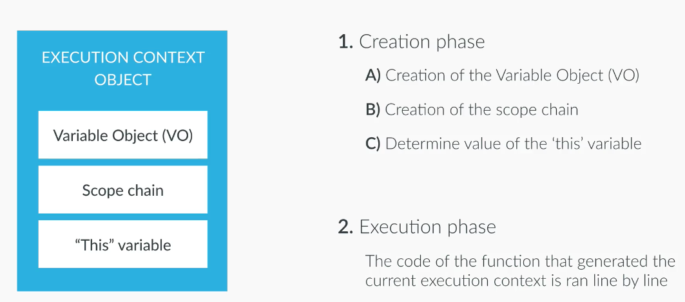

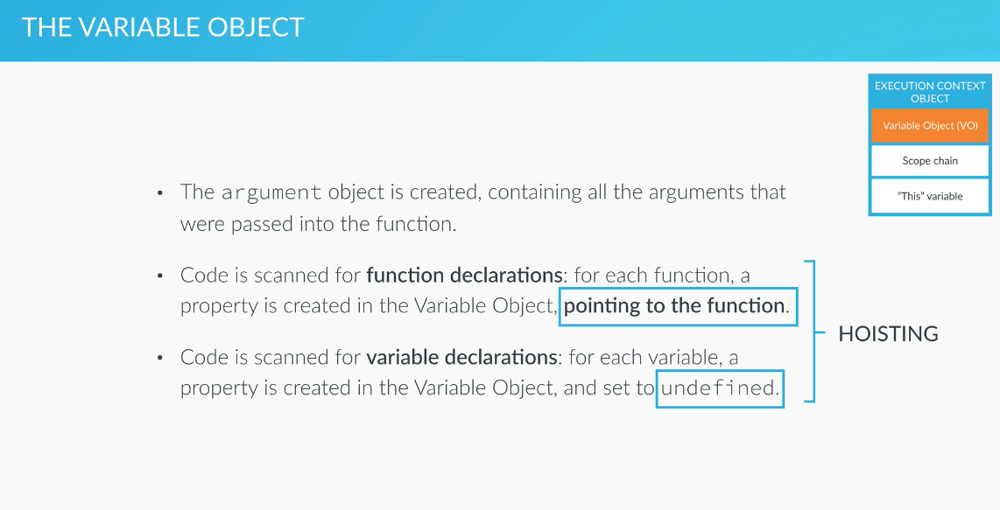

2. Scoping an Scope Chain

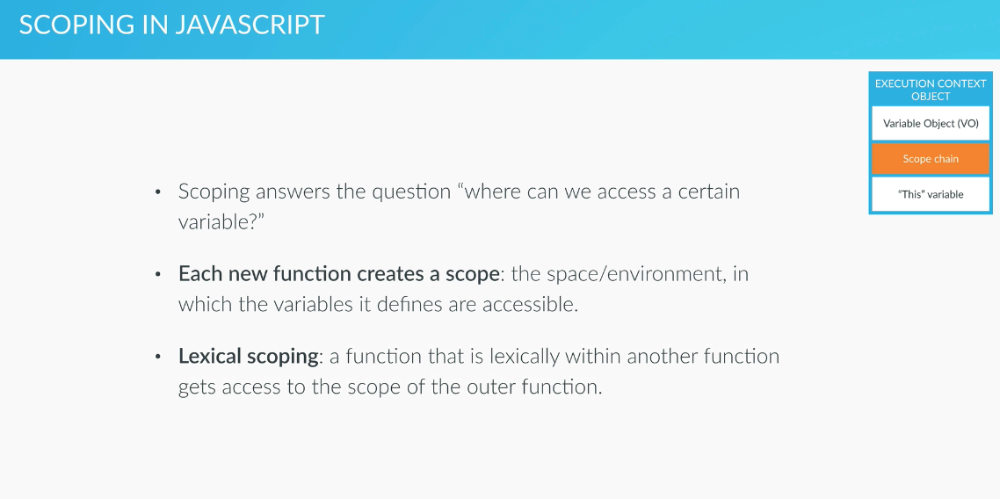

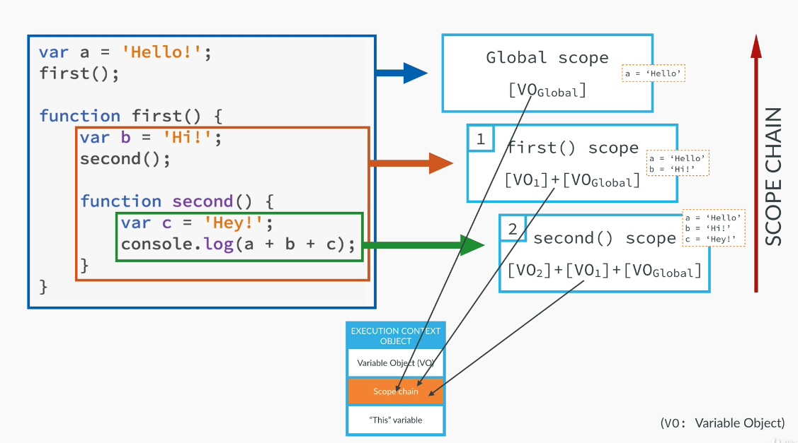


3. `This` keyword

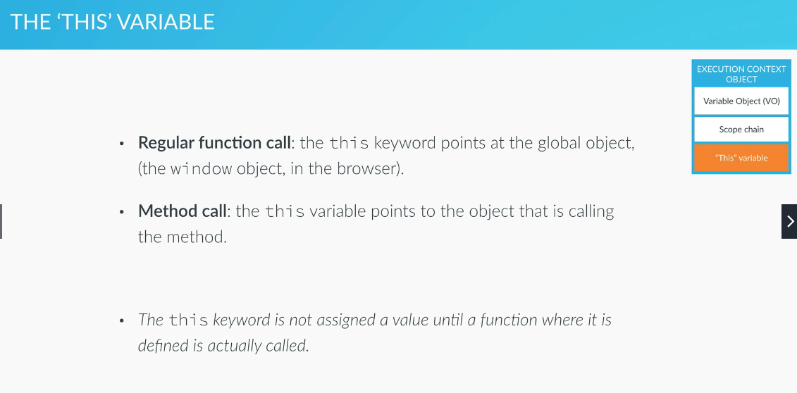


### Section 4 - JS in the Browser : DOM manipultations events

1. Accces and Manipulation 
https://www.w3schools.com/cssref/css_selectors.asp

https://developer.mozilla.org/it/docs/Web/API/Document/querySelector

https://developer.mozilla.org/it/docs/Web/API/Document/getElementById

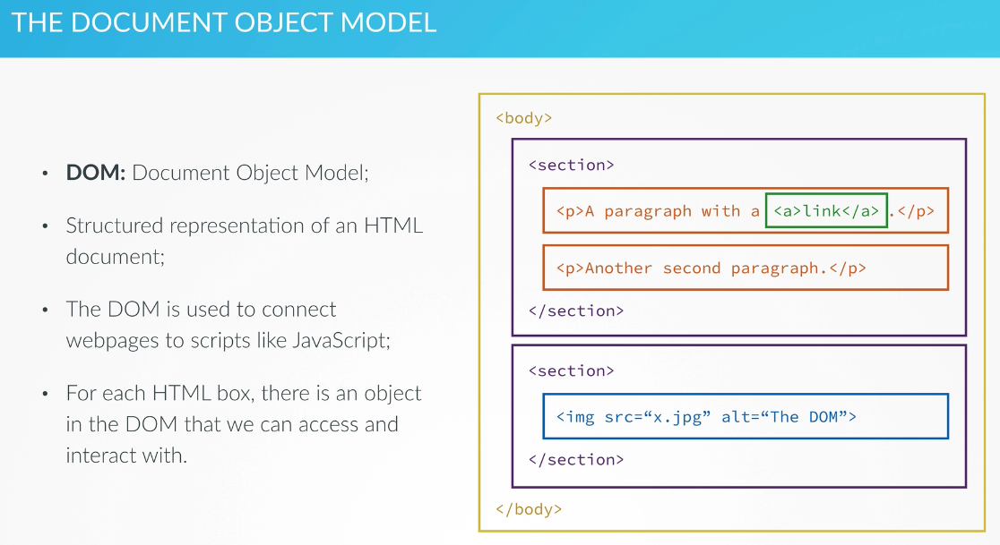

2. Events Handler
https://developer.mozilla.org/en-US/docs/Web/API/EventTarget/addEventListener

https://developer.mozilla.org/en-US/docs/Web/Events

3. Update score and change active player

### Section 5 - Advanced js Objects and Functions

1. Everything Is an Object Inheritance and the Prototype Chain

https://www.youtube.com/watch?v=VHlBwk_ZQRs&feature=youtu.be

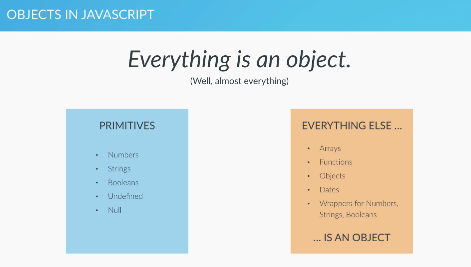

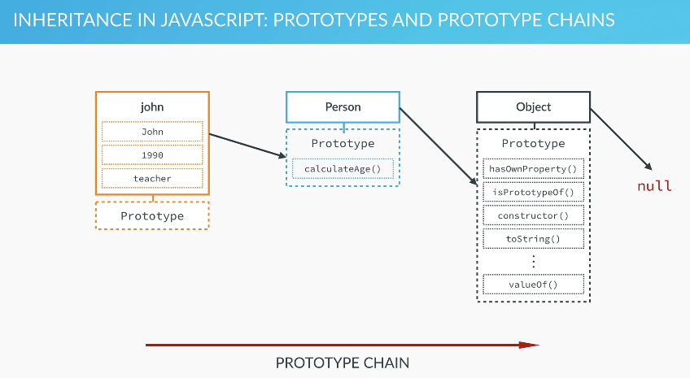

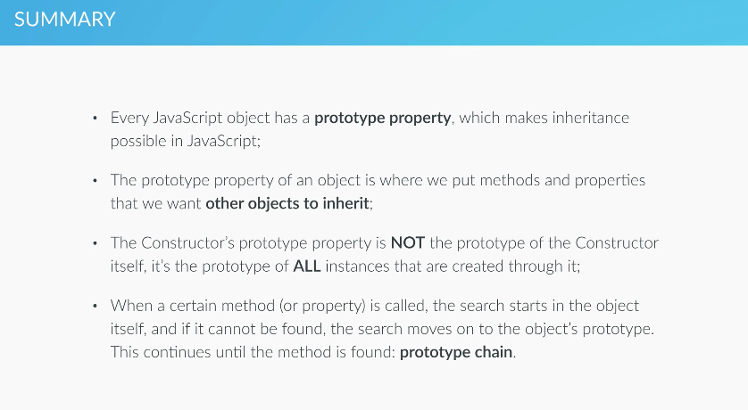


2. Creating Objects: Function

```js
Person {name: "John", yearOfBirth: 1990, job: "teacher", dajee: "Dajee"}
dajee: "Dajee"
job: "teacher"
name: "John"
yearOfBirth: 1990
__proto__:
    calculateAge: ƒ ()
    lastName: "Smith"
    constructor: ƒ (name, yearOfBirth, job)
    __proto__:
        constructor: ƒ Object()
        hasOwnProperty: ƒ hasOwnProperty()
        isPrototypeOf: ƒ isPrototypeOf()
        propertyIsEnumerable: ƒ propertyIsEnumerable()
        toLocaleString: ƒ toLocaleString()
        toString: ƒ toString()
        valueOf: ƒ valueOf()
        __defineGetter__: ƒ __defineGetter__()
        __defineSetter__: ƒ __defineSetter__()
        __lookupGetter__: ƒ __lookupGetter__()
        __lookupSetter__: ƒ __lookupSetter__()
        get __proto__: ƒ __proto__()
        set __proto__: ƒ __proto__()
```

```js
john.__proto__ === Person.prototype
true

john.hasOwnProperty('jdae')
false
john.hasOwnProperty('dajee')
true

john instanceof Person
true

```

*almost is an object*

```js
var x = [2,3]
undefined
x
(2) [2, 3]
console.info(x)
(2) [2, 3]
0: 2
1: 3
length: 2
__proto__: Array(0)
concat: ƒ concat()
constructor: ƒ Array()
copyWithin: ƒ copyWithin()
entries: ƒ entries()
every: ƒ every()
fill: ƒ fill()
filter: ƒ filter()
find: ƒ find()
findIndex: ƒ findIndex()
flat: ƒ flat()
flatMap: ƒ flatMap()
forEach: ƒ forEach()
includes: ƒ includes()
indexOf: ƒ indexOf()
join: ƒ join()
keys: ƒ keys()
lastIndexOf: ƒ lastIndexOf()
```

3.  The Prototype Chain in the Console

see `scripts.js`

4.  Creating Objects: Object.create

see `scripts.js`

5.  Primitives vs. Objects

see `scripts.js`

6.  First Class Functions: Passing Functions as Arguments

see `scripts.js`

7.  First Class Functions: Functions Returning Functions

see `scripts.js`

8.  Immediately Invoked Function Expressions (IIFE)

see `scripts.js`

9.  Closures

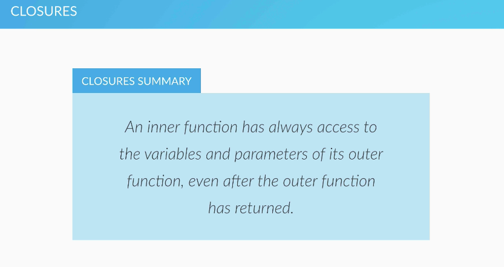

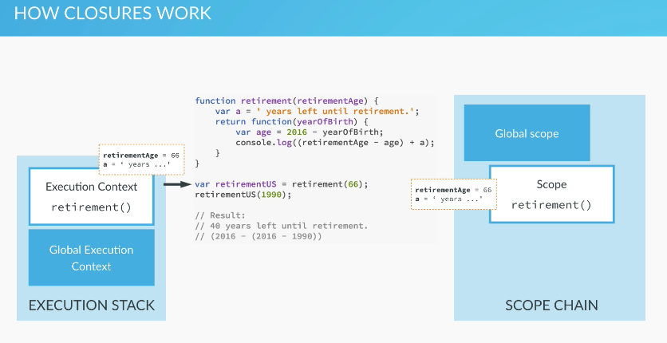
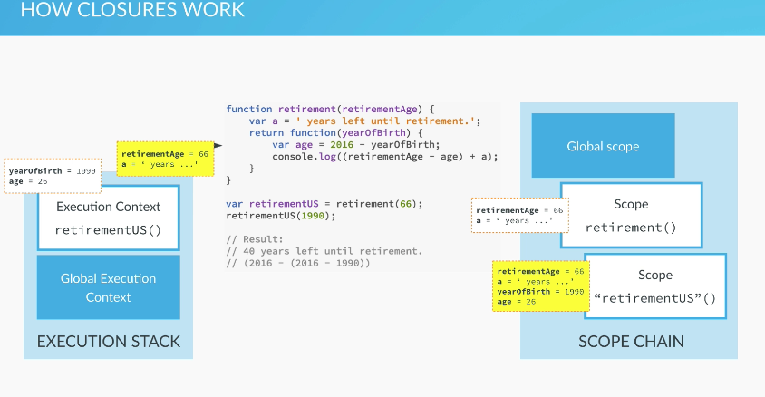

see `scripts.js`

10.  Bind, Call and Apply

- Function.prototype.**apply**(thisArg [, argsArray])
Calls a function and sets its this to the provided thisArg. Arguments can be passed as an Array object.

- Function.prototype.**bind**(thisArg[, arg1[, arg2[, ...argN]]])
Creates a new function which, when called, has its this set to the provided thisArg. Optionally, a given sequence of arguments will be prepended to arguments provided the newly-bound function is called.

- Function.prototype.**call**()
Calls a function and sets its this to the provided value. Arguments can be passed as they are.

see `scripts.js`

### Section 6 - The Budget App Porject 

see dir `6-budgety`

https://developer.mozilla.org/it/docs/Web/API/KeyboardEvent

http://keycodes.atjayjo.com/#unicode

https://developer.mozilla.org/it/docs/Web/API/Element/insertAdjacentHTML

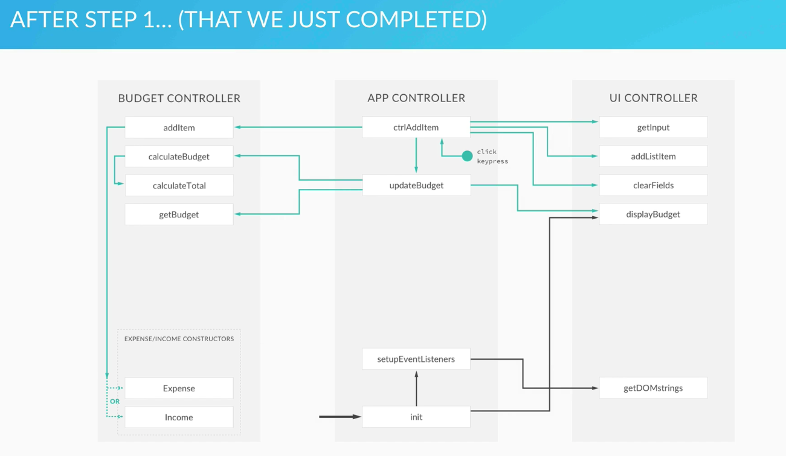

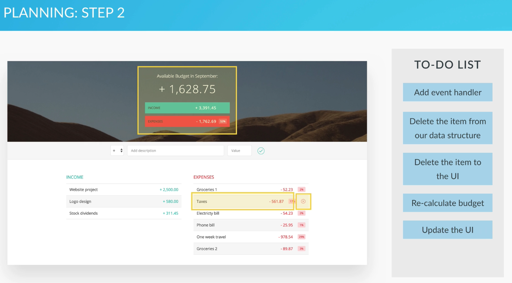

*Event Bubbling*

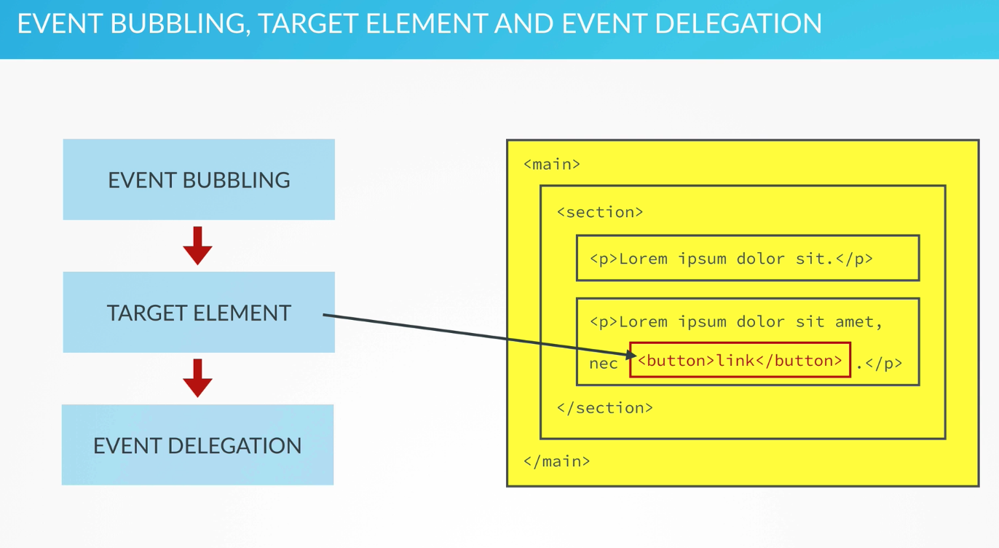

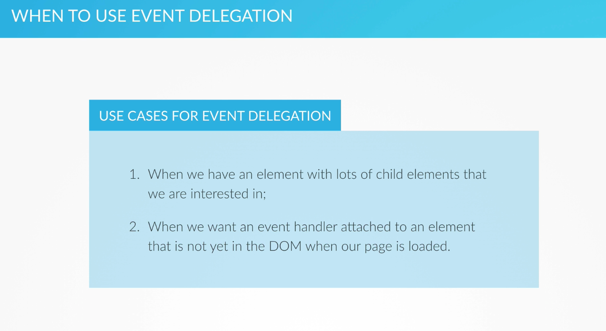

https://blog.garstasio.com/you-dont-need-jquery/dom-manipulation/

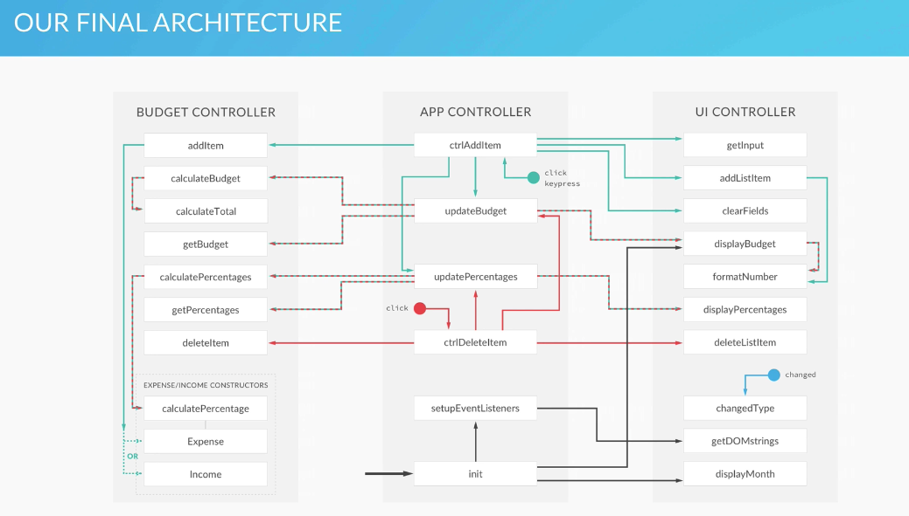

### Section 7

https://developer.mozilla.org/it/docs/Web/JavaScript/Reference/Operators/this

https://developer.mozilla.org/it/docs/Web/JavaScript/Reference/Global_Objects/Array/from

https://developer.mozilla.org/en-US/docs/Web/JavaScript/Reference/Global_Objects/Array/findIndex

https://developer.mozilla.org/en-US/docs/Web/JavaScript/Reference/Global_Objects/Array/find

https://developer.mozilla.org/it/docs/Web/JavaScript/Reference/Functions_and_function_scope/arguments

**Function.prototype** `apply` `bind` `call`
https://developer.mozilla.org/it/docs/Web/JavaScript/Reference/Global_Objects/Function/apply
https://developer.mozilla.org/it/docs/Web/JavaScript/Reference/Global_Objects/Function/bind
https://developer.mozilla.org/it/docs/Web/JavaScript/Reference/Global_Objects/Function/call

https://developer.mozilla.org/it/docs/Web/JavaScript/Reference/Global_Objects/Map

https://developer.mozilla.org/it/docs/Web/JavaScript/Reference/Global_Objects/Object/create


### Section 8

### Section 9

### Section 10

### Section 11

### Section 11